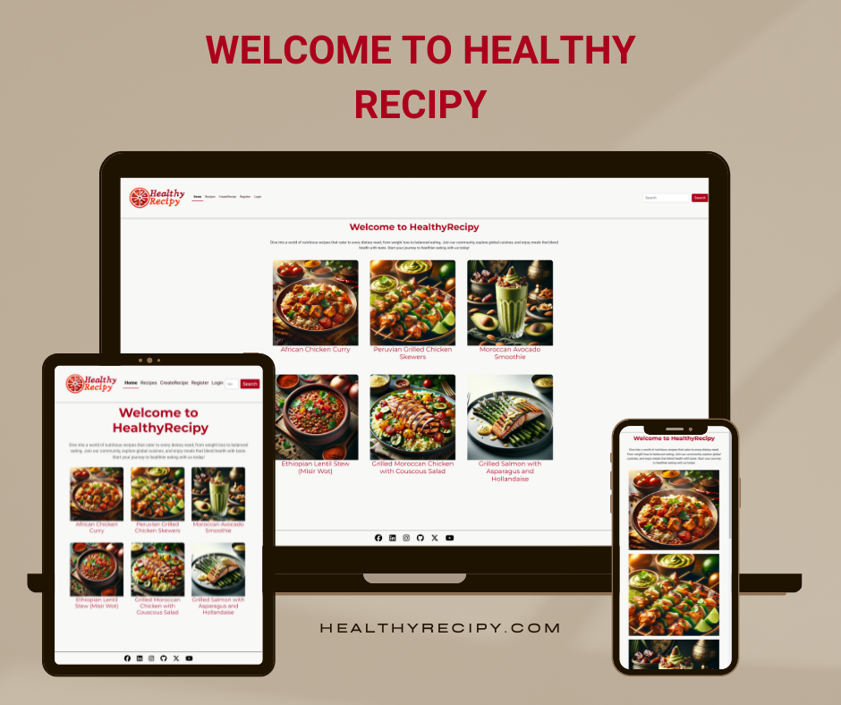

README.md
<h1 align="center">HealthyRecipyApp</h1>

  

You can find the live site [here](https://recipe-django-a56e80b1fce6.herokuapp.com/).

# HealthyRecipy App: Your Gateway to Healthier Eating 

Welcome to the **HealthyRecipy App**, where every meal is an opportunity to nourish your body and delight your palate. Designed with Django, our app bridges the gap between nutritional goals and culinary enjoyment, offering a meticulously curated selection of recipes from around the world for a healthier lifestyle.

## Why HealthyRecipy?

HealthyRecipy is built on the belief that healthy eating shouldn't be complicated or dull. With a user-friendly interface and a rich database of nutritious recipes, our app is the perfect companion for anyone looking to eat better without sacrificing taste or spending hours in the kitchen.

## Key Features

### Personalized Meal Planning

- **Curate Your Meals:** Utilize the Meal Planner to organize your daily eating schedule with recipes that align with your dietary preferences and health objectives.

- **Explore Recipes:** Dive into our expansive Recipes Page, which is the core of HealthyRecipy. Discover recipes that cater to various dietary needs and for all around the world.

### Designed for You

- **Rich Nutritional Info:** Every recipe is accompanied by calorie details, enabling you to make well-informed decisions about your meals.

- **Seamless Meal Tracking:** Add recipes to your Meal Planner effortlessly, keeping track of what you're eating and ensuring you stick to your dietary goals.

## Powered by Django & Python

The HealthyRecipy App is developed using Django, a high-level Python web framework known for its robustness, scalability, and versatility. Our application is engineered to facilitate a seamless and enriching user experience, making healthy eating straightforward and accessible.

### Our App at Work

- **User & Profile:** Register/ Sign up and personalize your HealthyRecipy experience. Each user profile is a gateway to a personalized meal planning journey.

- **Meal:** Plan your meals with precision. Our Meal Planner allows you to schedule and manage your daily intake based on the recipes you love.

- **Recipes:** At the heart of our app, the Recipes Page showcases a wide range of healthy dishes, complete with cooking instructions, ingredient lists, and nutritional values.

## Embark on Your Healthy Eating Journey

With the HealthyRecipy App, discover the joy of cooking and eating meals that are as nutritious as they are delicious. Say goodbye to guesswork and hello to a world where healthy eating is easy, enjoyable, and perfectly tailored to you.

Start your journey towards a healthier you with HealthyRecipy today.

# Table of Contents

1. [UX](#ux)
    - [Strategy](#strategy)
    - [User Stories](#user-stories)
2. [Scope](#scope)
    - [Features](#features)
    - [Future Features](#future-features)
3. [Structure](#structure)
4. [Wireframes](#wireframes)
5. [Database Schema](#database-schema)
6. [Surface](#surface)
7. [Technologies Used](#technologies-used)
8. [Testing](#testing)
9. [Deployment](#deployment)
10. [Credits](#credits)

    
# UX

Guided by fundamental UX principles, my initial approach centered on pinpointing the target audience for the HealthyRecipy app and discerning the specific features that would provide the most value to them.

The target audience for HealthyRecipy encompasses:

- Individuals across all demographics, with a notable emphasis on those who play a significant role in meal planning and preparation within households.
- Health-conscious individuals seeking inspiration and guidance for crafting nutritious meals for themselves and their loved ones.
- Culinary enthusiasts eager to explore and experiment with new healthy recipes, regardless of their cooking expertise level.

  
These users seek:

- An app that is user-friendly, offering clear, readily available information and inspiration for crafting healthy meals.
- A service that curates a collection of wholesome recipes that are straightforward and quick to prepare.
- The ability to establish a personal account, enhancing interactivity with the app’s offerings.

The HealthyRecipy app is designed to fulfill these needs, providing a user-friendly experience that encourages exploration, interaction, and the discovery of nutritious and delicious meal options.

## Strategy

Using the core UX principles I envisaged a Strategy, thinking about the features, goals, needs, and  target audience, they would benefit from.

### Features

- **Expansive Recipe Database**: From breakfast to dinner, find recipes that taste great and are good for you.
- **Customizable Meal Plans**: Tailor your meal plan according to your dietary needs, preferences, and fitness goals.
- **Nutritional Information**: Every recipe comes with detailed calories information to help you keep track of your calorie intake and nutrient balance.
- **Easy-to-Use Interface**: Our user-friendly platform makes it simple to **search, find, and store your favorite recipes**.
- **Cross-Platform Accessibility**: Access HealthyRecipy from any device, ensuring you have your recipes and meal plans handy whether you're at home or on the go.

### Goals

- To make healthy eating accessible and appealing to a wide audience by providing a diverse range of recipes.
- To foster healthy cooking habits for all individuals who are passionate about healthy living and cooking.
- To empower users with tools and information that aid in making informed dietary choices.

### Needs

- An easy-to-use platform to store, categorise, and retrieve recipes. 
- Quick editing capabilities for personalizing recipes based on preferences. 
- Mobile-friendly access for convenience while shopping or cooking. 

### Target Audience

HealthyRecipy is designed for individuals of all ages who are interested in maintaining a healthy lifestyle through diet. Specifically, our platform caters to:

- **Age**: Adults of all ages, from young adults (18+) to seniors.
- **Occupation**: Includes but is not limited to busy professionals, parents, and students who are looking for quick, healthy meal solutions.
- **Interests**: Individuals with a keen interest in nutrition, cooking, and fitness. Those looking to lose weight, manage dietary conditions, or simply lead a healthier lifestyle.
- **Tech-Savviness**: Our platform is designed to be accessible for users with varying levels of technological expertise, from beginners to advanced.

By addressing the needs and challenges faced by our target audience, HealthyRecipy aims to be a comprehensive resource for anyone looking to enhance their dietary habits through healthy, delicious recipes.

## User Stories

**Epic:Non-logged in user**

| I want to... | So that I can... | Acceptance Criteria |
| ----------- | ----------- | ----------- |
| Create an account | Store my personal recipes | **AC1:** User can create an account through a registration form. **AC2:** User can log in to their account using their credentials. **AC3:** User can log out of their account, ensuring their session is securely ended. |
| Browse through recipes | Find some new meal ideas | **AC1:** Admin-created recipes are available to all users, ensuring wide accessibility. **AC2:** Non-logged in users can view admin-created recipes, promoting discovery without the need for account creation. **AC3:** Non-logged in users have read-only access to recipes, allowing browsing without the ability to alter content. |

**Epic:Logged in User**

| I can... | So that I can... | Acceptance Criteria |
| ----------- | ----------- | ----------- |
| Create an account | Store my personal recipes | **AC1:** User can create an account through a registration form. **AC2:** User can log in to their account using their credentials. **AC3:** User can log out of their account, ensuring their session is securely ended. |
| Edit or delete my recipes | Update them | **AC1:** Users can edit their recipes through an edit functionality accessible on their recipe pages. **AC2:** Users can delete their recipes using a delete option available on their recipe pages. **AC3:** Edit and delete functionalities are only available to the user who created the recipe; a 403 error is returned otherwise. |
| Add picture and description to my recipes | I can easily find the one I am looking for | **AC1:** Users can add a picture when uploading or editing recipes. **AC2:** Pictures are automatically resized to fit the website’s layout. **AC3:** Users can add a description to their recipes during the upload process. |
| Store my recipes in one place | I can easily browse and retrieve them | **AC1:** Users have a list view of all their recipes for easy browsing. **AC2:** Each recipe in the list view is a clickable link that takes the user to the full recipe page. |
| View the ingredients and method for my recipes | Follow the recipe without having to touch the screen | **AC1:** Ingredients and method sections are displayed side by side on medium and large screens to minimize scrolling. |
| Have a personalised home page | View my own recipes | **AC1:** A generic homepage is available for all users. **AC2:** Logged-in users see a personalized homepage displaying their own recipes. |
| Categorise my recipes by cooking method | Plan my meals easily | **AC1:** Users can select categories for their recipes when adding or editing them. **AC2:** Users can filter recipes by these categories to find them more easily. |
| Be able to log into the same account as my family | My household can share an account | **AC1:** Users can log in using a username that allows multiple people to access the same account. **AC2:** A "keep logged in" function is available for ease of access. |
| Search my recipes | To quickly find the recipe I want | **AC1:** A search bar is included in the site’s navigation. **AC2:** The search bar functionality enables searching through recipes. **AC3:** Users can search recipes using a variety of parameters. |
| Add recipes to favourites | View my favourite recipes easily | **AC1:** Users can add recipes to their favourites using a specific button. **AC2:** This functionality applies to both user and admin recipes. **AC3:** Favourite recipes are displayed on a dedicated page. **AC4:** Recipes have an indicator to show if they are a favourite. |

**Epic: Admin**

| I can... | So that I can... | Acceptance Criteria |
| ----------- | ----------- | ----------- |
| Create, edit and delete recipes and comments | Manage the site content | **AC1:** Admin can access a form to input new recipe details, including title, description, ingredients, and preparation steps. 
| Access the admin panel | Manage recipes and comments | **AC1:** Admin can log in to the admin panel using their credentials. **AC2:** Upon successful login, admin is directed to the dashboard where they can manage recipes, comments, and site content. **AC3:** Incorrect login attempts are handled gracefully, displaying an error message and the opportunity to retry. |
| Log out of the admin panel | Disconnect from the website securely | **AC1:** A log-out option is clearly accessible from anywhere within the admin panel. **AC2:** Selecting the log-out option immediately ends the admin session. **AC3:** Upon logging out, the admin is redirected to the login page, ensuring they are fully disconnected. |

# Scope

## Features

- **Recipe Discovery:** Users can explore a wide array of healthy recipes within the app. Each recipe is carefully selected to ensure it meets various dietary preferences and health goals, including gluten-free, vegan, low-carb, and more.

- **Detailed Nutritional Information:** Every recipe comes with comprehensive nutritional details, helping users make informed choices about their meals and how they fit into their dietary requirements.

- **Personalized Meal Planner:** The Meal model allows users to schedule their daily meals using the recipes available in the app. This feature helps in organizing meal times and ensuring nutritional goals are met.

- **Rich User Profiles:** While primarily functional at this stage for meal planning and recipe discovery, user profiles lay the groundwork for a more personalized app experience, including tracking favorite recipes and meal planning history.

## Future Features

- **Social Sharing:** In future updates, we plan to introduce functionality that will allow users to share their favorite recipes and meal plans with friends and family, enhancing the app's social aspect.

- **User-Generated Content:** We envision a platform where users can contribute their own recipes, subject to moderation to ensure they meet our health and nutritional standards. This will enrich our database and allow for a more diverse culinary experience.

- **Interactive Meal Feedback:** Future iterations will include features for users to rate recipes and provide feedback, helping others in the app community make better meal choices based on collective experiences.

- **Advanced Dietary Customization:** We aim to incorporate advanced filtering options that allow users to customize their recipe discovery and meal planning based on specific dietary needs, intolerances, and nutritional goals.

- **Integration with Fitness Apps:** To offer a holistic approach to health and wellness, we plan to integrate with popular fitness and health tracking apps. This will allow users to see the full picture of their health journey, from calorie intake to physical activity.

- **AI-Based Recipe Recommendations:** Leveraging AI and machine learning, we plan to offer personalized recipe recommendations based on users' tastes, dietary restrictions, and meal planning habits, making discovery even more intuitive and customized.

### **Home Page**
*Navigation bar:* 
- The navigation bar appears on every page so users can easily navigate through the site
- Navigation bar has links for 'Home', 'My Recipes', 'Healthy Recipes', 'Add recipe' and 'Login/Register' more links will be shown to logged in users
- If the user is logged in then they can access pages that only authorized users can visit and use, they are: 'Favorite Recipes', 'Your Recipes' and  'Logout'. Otherwise, the user will be given the option to 'Register' or 'Login'
- A search bar is nested in the navbar to find recipes quickly
- The navbar is fully responsive, collapsing into a hamburger menu for medium and small screen size

*Home Page Images:*
- The home page images welcome the user with a short message advertising what the website is about. These images will be changing overtime with the addition of new recipes.
- The Login / Register button will take users to the login page, if users do not have an account there is a link to the registration page

*Recently added recipes:*
- Recently Added section shows the latest published recipes so users can quickly see recently published recipes
- The Recently Added section is fully responsive, showing 4 recipe cards
- Each recipe takes the user to the recipe details page
- Users can also see title, image, author, date posted, short description and number of likes

*Latest Recipes:*
- Each recipe takes the user to the recipe details page
- At the bottom of the list there is a link to the Recipes page that takes users to the page with all the recipes

*Footer:*
- Appears on every page and contains social links
- Links are opened in a new tab to avoid dragging users from our site

### **Healthy Recipes Page**
- The Recipes page shows all the published recipes, recipes are shown in order from newest to oldest
- The site will paginate all recipe cards to display 6 to a page
- Each recipe card will display an image and title of the recipe
- Each recipe card takes users to the recipe details page 

### **Login/Register**
- The Login / Register button takes users to the login page where they can also find a link to the Register page where they can create an account

### **Favorite Recipes Page**
- Only logged in users can see Favorite Recipes Page
- The Favorite Recipes page shows all the recipes that the user liked

### **My Recipes Page**
- The 'My Recipes' page displays all the recipes that user has created
- At the top there is an Add Recipe button which takes user to the add recipe page
- Each recipe has two buttons, Edit and Delete
- Edit button takes user to the edit page
- Clicking the Delete button will display the message asking the users if they are sure they want to delete that particular recipe

### **Recipes Details Page**
- The Recipes Details Page displays all the information about the selected recipes
- At the top of the page, the recipe card will display Recipes name, author name, date posted and image
- The main body of the page contains short description of the recipe, ingredients and preparation steps
- Number of likes and comments are displayed after the preparation steps
- Commenting section is located at the end of the page, only logged in users can leave a comment

### **Add Recipe Page**
- On the Add Recipe page users can add their recipes to the website
- The user must fill in all the fields in order for the recipe to be published
- If the user doesn't fill in one of the fields the error message appears
- If the user doesn't provide their image, the default image is displayed
- The Add Recipe button is located at the end of the page

### Future Features
- Categories
- Users settings
- Calories Intake/per meal
- Preparation time
- Notification for likes and comments

# Structure
 
 Simplicity helps users to quickly and easily access the app and navigate within the app.

#Apps in the project

# Wireframes

All wireframes were created used [draw.io](https://draw.io/)

Wireframes for each device are linked here:
- [Desktop Wireframe - Homepage & Login/Register](assets\documents\Images\wireframe__desktop_1_drawio.png)
- [Desktop](assets\documents\Images\wireframe_desktop_2.png)
- [Tablet](assets/documents/Tablet-wireframes)
- [Mobile](assets/documents/Mobile-wireframes)

# Database schema

## Models
### **Recipe Model**

### ** Model**

# Surface

## Design 

## Chosen Color 
Color palette from [Coolorpalettes][[https://colorpalettes.net/color-palette-4486/]

- **#** - Color for the navigation bar. Complements the hero image well.
- **#** - Color selected for the buttons. This hue was picked as it harmonizes with the page's overall aesthetic and enhances its appearance.
- **#** - Main body color of the site. Chosen for its compatibility with the page's design, this color offers a softer alternative to stark white.
- **#** - Chosen as the backdrop for the login/register sections, this color coordinates well with the adjacent image.
- **#** - Background color used for the footer.

## Font 
- Verdana, sans-serif - main font
- Nadira- for navbar logo and welcome message

# Technologies Used

## Languages 
- [HTML5](https://en.wikipedia.org/wiki/HTML5)
- [CSS3](https://en.wikipedia.org/wiki/CSS)
- [Python](https://www.python.org/)

## Frameworks, Libraries & Programs Used
[GitHub](https://github.com/) - Holds the repository of my project, GitHub connects to GitPod and Heroku.

[GitPod](https://gitpod.io/workspaces) – Connected to GitHub, GitPod hosted the coding space, allowing the project to be built and then committed to the GitHub repository. 

[Heroku](https://www.heroku.com/) - Connected to the GitHub repository, Heroku is a cloud application platform used to deploy this project so the backend language can be utilised/tested. 

[Django](https://www.djangoproject.com/) - This framework was used to build the foundations of this project

[Gunicorn](https://gunicorn.org/) - Gunicorn is a pure-Python HTTP server for WSGI applications.

[Dj Database URL](https://pypi.org/project/dj-database-url/) - This allows you to utilize the 12factor inspired DATABASE_URL environment variable to configure your Django application.

[Bootstrap](https://getbootstrap.com/) - Used to quickly add design to my website, Bootstrap focuses on mobile first design meaning this website is responsive across multiple devices ans screen sizes. 

[Cloudinary](https://cloudinary.com/?utm_source=google&utm_medium=cpc&utm_campaign=Rbrand&utm_content=492438439811&utm_term=cloudinary&gclid=Cj0KCQiAt8WOBhDbARIsANQLp96hTerzfFJ_P9lX0tEYEdtM3tSsYB6fhw-x3wQxOO0oc4hXm-A2ZBUaAptIEALw_wcB) - Used to store images online for the recipe posts. 

[Summernote](https://summernote.org/) Used to add a text area field to the admin setup to enable a list of ingredients and method steps.

[Google Fonts](https://fonts.google.com/https://fonts.google.com/) - provide fonts for the website.

[Font Awesome](https://fontawesome.com/) -was used for icons.

[Drawio](https://draw.io/) - was used to create site wireframes.

[Am I Responsive](http://ami.responsivedesign.is/) - to check if the site is responsive on different screen sizes.

[Pixabay](https://pixabay.com/) and [Unsplash](https://unsplash.com/) - were used for all the images

[W3C Markup Validator](https://validator.w3.org/#validate_by_input) - was used to validate HTML

[W3C CSS Validator](https://jigsaw.w3.org/css-validator/) - was used to validate CSS

[Beautify](https://www.jpkc.com/tools/beautify/) - was used to correct indentation issues and get rid of too much whitespace - HTML, CSS

[Coolors]- to make color palette

# Testing

## User Story Testing

### **Testing Users Stories form (UX) Section**

**EPIC: Superuser / Admin**

**EPIC: User Interaction**

**EPIC: User Recipes**

**EPIC: Login/Register**

## Bugs and Issues
-

# Deployment
This project was deployed using Github and Heroku.

## Github 
To create a new repository I took the following steps:

- Logged into Github.
- Clicked over to the ‘repositories’ section.
- Clicked the green ‘new’ button. This takes you to the create new repository page.
- I am using VS Code therefore I creatdd my own template from scrath and also setup my virtual environment in the VS Code terminal.
- I created the repository for this project in GitHub and then I open it via GitHub Desktop and cloned it to my local machine.
- I then open the repository in VS Code and worked and estabished the virtual environment via Git Bash.

## Django and Heroku 
- To get the Django framework installed and set up I followed the Code institutes [Django Blog cheatsheet](https://codeinstitute.s3.amazonaws.com/fst/Django%20Blog%20Cheat%20Sheet%20v1.pdf)

# Credits

## Media
- All images were taken from
## Acknowledgements
