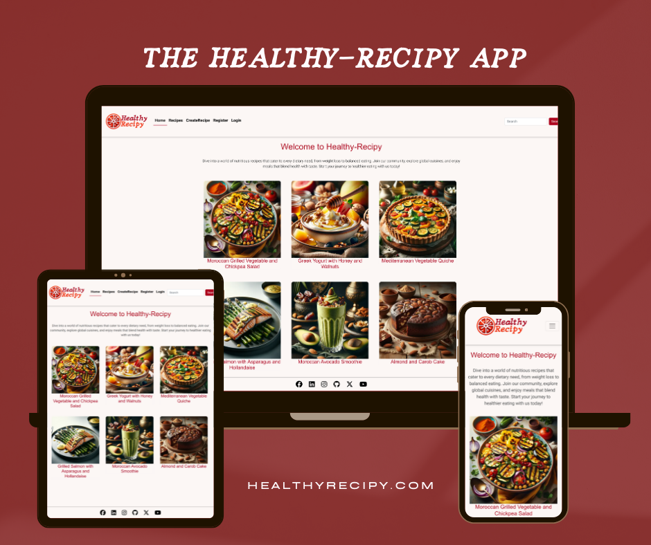
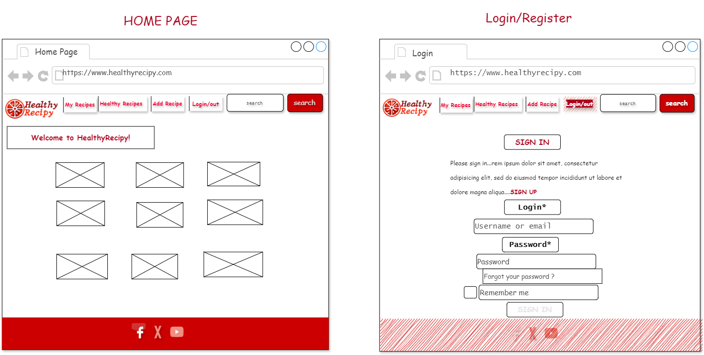
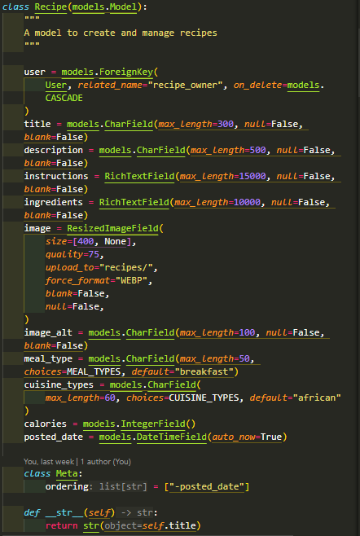
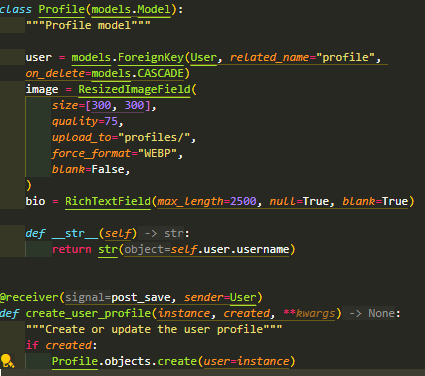

README.md
<h1 align="center">The HealthyRecipy App</h1>

  


You can find the live site [here](https://recipe-django-a56e80b1fce6.herokuapp.com/).


# HealthyRecipy App: Your Gateway to Healthier Eating 

Welcome to the **HealthyRecipy App**, where every meal is an opportunity to nourish your body and delight your palate. Designed with Django, our app bridges the gap between nutritional goals and culinary enjoyment, offering a meticulously curated selection of recipes from around the world for a healthier lifestyle.

## Why HealthyRecipy?

HealthyRecipy is built on the belief that healthy eating shouldn't be complicated or dull. With a user-friendly interface and a rich database of nutritious recipes, our app is the perfect companion for anyone looking to eat better without sacrificing taste or spending hours in the kitchen.

## Key Features

### Personalized Meal Planning

- **Curate Your Meals:** Utilize the Meal Planner to organize your daily eating schedule with recipes that align with your dietary preferences and health objectives.

- **Explore Recipes:** Dive into our expansive Recipes Page, which is the core of HealthyRecipy. Discover recipes that cater to various dietary needs and for all around the world.

### Designed with the User in Mind

- **Rich Nutritional Info:** Every recipe is accompanied by calorie details, enabling you to make well-informed decisions about your meals.

- **Seamless Meal Tracking:** Add recipes to your Meal Planner effortlessly, keeping track of what you're eating and ensuring you stick to your dietary goals.

## Powered by Django & Python

The HealthyRecipy App is developed using Django, a high-level Python web framework known for its robustness, scalability, and versatility. Our application is engineered to facilitate a seamless and enriching user experience, making healthy eating straightforward and accessible.

### Our App at Work

- **User & Profile:** Register/ Sign up and personalize your HealthyRecipy experience. Each user profile is a gateway to a personalized meal planning journey.

- **Meal:** Plan your meals with precision. Our Meal Planner allows you to schedule and manage your daily intake based on the recipes you love.

- **Recipes:** At the heart of our app, the Recipes Page showcases a wide range of healthy dishes, complete with cooking instructions, ingredient lists, and nutritional values.

## Healthy Eating Journey

With the HealthyRecipy App, discover the joy of cooking and eating meals that are as nutritious as they are delicious. Say goodbye to guesswork and hello to a world where healthy eating is easy, enjoyable, and perfectly tailored to you.

Start your journey towards a healthier you with HealthyRecipy today.


# Table of Contents

1. [UX](#ux)
    - [Strategy](#strategy)
    - [User Stories](#user-stories)
2. [Scope](#scope)
    - [Features](#features)
    - [Future Features](#future-features)
3. [Structure](#structure)
4. [Wireframes](#wireframes)
5. [Database Schema](#database-schema)
6. [Surface](#surface)
7. [Technologies Used](#technologies-used)
8. [Testing](#testing)
9. [Deployment](#deployment)
10. [Credits](#credits)

    
# UX

Guided by fundamental UX principles, my initial approach centered on pinpointing the target audience for the HealthyRecipy app and discerning the specific features that would provide the most value to them.

The target audience for HealthyRecipy encompasses:

- Individuals across all demographics, with a notable emphasis on those who play a significant role in meal planning and preparation within households.
- Health-conscious individuals seeking inspiration and guidance for crafting nutritious meals for themselves and their loved ones.
- Culinary enthusiasts eager to explore and experiment with new healthy recipes, regardless of their cooking expertise level.

  
These users seek:

- An app that is user-friendly, offering clear, readily available information and inspiration for crafting healthy meals.
- A service that curates a collection of wholesome recipes that are straightforward and quick to prepare.
- The ability to establish a personal account, enhancing interactivity with the app’s offerings.


The HealthyRecipy app is designed to fulfill these needs, providing a user-friendly experience that encourages exploration, interaction, and the discovery of nutritious and delicious meal options.


## Strategy

Using the core UX principles I envisaged a Strategy, thinking about the features, goals, needs, and  target audience, they would benefit from.

### Features

- **Expansive Recipe Database**: From breakfast to dinner, find recipes that taste great and are good for you.
- **Customizable Meal Plans**: Tailor your meal plan according to your dietary needs, preferences, and fitness goals.
- **Nutritional Information**: Every recipe comes with detailed calories information to help you keep track of your calorie intake and nutrient balance.
- **Easy-to-Use Interface**: Our user-friendly platform makes it simple to **search, find, and store your favorite recipes**.
- **Cross-Platform Accessibility**: Access HealthyRecipy from any device, ensuring you have your recipes and meal plans handy whether you're at home or on the go.

### Goals

- To make healthy eating accessible and appealing to a wide audience by providing a diverse range of recipes.
- To foster healthy cooking habits for all individuals who are passionate about healthy living and cooking.
- To empower users with tools and information that aid in making informed dietary choices.

### Needs

- An easy-to-use platform to store, categorise, and retrieve recipes. 
- Quick editing capabilities for personalizing recipes based on preferences. 
- Mobile-friendly access for convenience while shopping or cooking. 

### Target Audience

HealthyRecipy is designed for individuals of all ages who are interested in maintaining a healthy lifestyle through diet. Specifically, our platform caters to:

- **Age**: Adults of all ages, from young adults (18+) to seniors.
- **Occupation**: Includes but is not limited to busy professionals, parents, and students who are looking for quick, healthy meal solutions.
- **Interests**: Individuals with a keen interest in nutrition, cooking, and fitness. Those looking to lose weight, manage dietary conditions, or simply lead a healthier lifestyle.
- **Tech-Savviness**: Our platform is designed to be accessible for users with varying levels of technological expertise, from beginners to advanced.

By addressing the needs and challenges faced by our target audience, HealthyRecipy aims to be a comprehensive resource for anyone looking to enhance their dietary habits through healthy, delicious recipes.


## User Stories

**Epic:Non-logged-in user**

| I want to... | So that I can... | Acceptance Criteria |
| ----------- | ----------- | ----------- |
| Create an account | Store my personal recipes | **AC1:** User can create an account through a registration form.<br>**AC2:** User can log in to their account using their credentials.<br>**AC3:** User can log out of their account, ensuring their session is securely ended. |
| Browse through recipes | Find some new meal ideas | **AC1:** Recipes are available to all users, ensuring wide accessibility.<br>**AC2:** Non-logged in users can view admin-created recipes, promoting discovery without the need for account creation.<br>**AC3:** Non-logged in users have read-only access to recipes, allowing browsing without the ability to alter content. |


**Epic:Logged in User**

| I can... | So that I can... | Acceptance Criteria |
| ----------- | ----------- | ----------- |
| Create an account | Store my personal recipes | **AC1:** User can create an account through a registration form.<br>**AC2:** User can log in to their account using their credentials.<br>**AC3:** User can log out of their account, ensuring their session is securely ended. |
| Edit or delete my recipes | Update them | **AC1:** Users can edit their recipes through an edit functionality accessible on their recipe pages.<br>**AC2:** Users can delete their recipes using a delete option available on their recipe pages.<br>**AC3:** Edit and delete functionalities are only available to the user who created the recipe; a 403 error is returned otherwise. |
| Add picture and description to my recipes | I can easily find the one I am looking for | **AC1:** Users can add a picture when uploading or editing recipes.<br>**AC2:** Pictures are automatically resized to fit the website’s layout.<br>**AC3:** Users can add a description to their recipes during the upload process. |
| Store my recipes in one place | I can easily browse and retrieve them | **AC1:** Users have a list view of all their recipes for easy browsing.<br>**AC2:** Each recipe in the list view is a clickable link that takes the user to the full recipe page. |
| View the ingredients and method for my recipes | Follow the recipe without having to touch the screen | **AC1:** Ingredients and method sections are displayed side by side on medium and large screens to minimize scrolling. |
| Have a personalised home page | View my own recipes | **AC1:** A generic homepage is available for all users.<br>**AC2:** Logged-in users see a personalized homepage displaying their own recipes. |
| Categorise my recipes by cooking method | Plan my meals easily | **AC1:** Users can select categories for their recipes when adding or editing them.<br>**AC2:** Users can filter recipes by these categories to find them more easily. |
| Be able to log into the same account as my family | My household can share an account | **AC1:** Users can log in using a username that allows multiple people to access the same account.<br>**AC2:** A "keep logged in" function is available for ease of access. |
| Search my recipes | To quickly find the recipe I want | **AC1:** A search bar is included in the site’s navigation.<br>**AC2:** The search bar functionality enables searching through recipes.<br>**AC3:** Users can search recipes using a variety of parameters. |
| Add recipes to favourites | View my favourite recipes easily | **AC1:** Users can add recipes to their favourites using a specific button.<br>**AC2:** This functionality applies to both user and admin recipes.<br>**AC3:** Favourite recipes are displayed on a dedicated page.<br>**AC4:** Recipes have an indicator to show if they are a favourite. |


**Epic: Admin**

| I can... | So that I can... | Acceptance Criteria |
| ----------- | ----------- | ----------- |
| Create, edit and delete recipes and comments | Manage the site content | **AC1:** Admin can access a form to input new recipe details, including title, description, ingredients, and preparation steps.<br>
| Access the admin panel | Manage recipes and comments | **AC1:** Admin can log in to the admin panel using their credentials.<br>**AC2:** Upon successful login, admin is directed to the dashboard where they can manage recipes, comments, and site content.<br>**AC3:** Incorrect login attempts are handled gracefully, displaying an error message and the opportunity to retry. |
| Log out of the admin panel | Disconnect from the website securely | **AC1:** A log-out option is clearly accessible from anywhere within the admin panel.<br>**AC2:** Selecting the log-out option immediately ends the admin session.<br>**AC3:** Upon logging out, the admin is redirected to the login page, ensuring they are fully disconnected. |


# Scope
## **Features**


## Home Page

### Navigation bar:


<p align="center">


- #### Persistent Navigation Bar
Our website features a constant navigation bar across all pages, ensuring that users can seamlessly navigate through the site. This accessibility is our priority, making site exploration intuitive and straightforward.

- #### Comprehensive Link Options
The navigation bar is equipped with essential links including **'Home'**, **'Recipes'**, **'Create Recipe'**, **'Register'**, and **'Login'**. Notably, the 'Login' link directs users to the **Sign In Page**, while 'Register' leads to the **Sign Up Page**. Additional functionalities become available to users upon login, enhancing the user experience with more tailored options.</p>

- #### Exclusive Access for Logged-In Users
Authenticated users gain exclusive access to certain pages designed for registered members. These include:

- **'Profile':** A personal hub showcasing the user's own recipes and their favorite selections. It's also equipped with 'Edit' and 'Meals' buttons, enabling users to modify their profile and access the Meal Planner, respectively.
- **'Logout':** For securely ending sessions.

- #### Quick Recipe Search
Embedded within the navigation bar, the search feature allows users to effortlessly find recipes. This tool is designed for efficiency, ensuring your favorite recipes are just a search away.

- #### Responsive Design
The navigation bar's design is responsive, accommodating various screen sizes by transforming into a hamburger menu on medium and small devices. This ensures a smooth and consistent user experience across all browsing environments.
</p>


### Home Page Image: 


- #### Engaging Homepage Imagery
Upon visiting the homepage, users are greeted with captivating images accompanied by a brief message that encapsulates the essence of our website. These images not only set the tone but also provide a glimpse into what users can expect - a vibrant community centered around sharing and discovering recipes. The imagery on the homepage is dynamic, evolving to feature new and exciting recipes over time, ensuring the experience remains fresh and engaging.

- #### Seamless Login and Registration Process
The **Login/Register** button is designed for straightforward navigation to the authentication process. For newcomers without an account, a conveniently placed link directs them to the registration page, ensuring a smooth transition into becoming a part of our community. This process is streamlined to facilitate easy access to our website's features, making the journey from visitor to member as seamless as possible.


## Recipes Page:  
Our goal is to provide an engaging and informative platform where users can easily access and enjoy the latest in the world of recipes.


- **Stay Updated:** Navigate directly to the most recently published recipes to discover new culinary inspirations.
  Our platform ensures that the freshest content is always at your fingertips, allowing you to stay current with the latest culinary trends.
- **Optimized for Every Device:** Experience seamless browsing with a fully responsive design that adapts to any screen size. Our recipe cards are designed to provide an optimal viewing experience, showcasing the latest recipes in a visually appealing manner, regardless of the device you're using.

- When the user click on the recipe card is redirected to the **recipe details page**:

## Recipe Details Page
Explore the culinary world with just a click on a recipe card, leading you to the **Recipe Details Page**.


- **Detailed Recipe Insights:** By selecting a recipe card, you'll be taken to the **Recipe Details Page**.
  Here, every recipe is presented with comprehensive details to enhance your cooking journey, including:
  - **Title:** Discover the name of the dish that caught your eye.
  - **Image:** A visual representation to inspire your culinary creation.
  - **Author:** Learn about the culinary expert behind the recipe.
  - **Date Posted:** Know when the recipe was shared with our community.
  - **Short Description:** Get a glimpse of the dish's essence and what makes it special.
  - **Ingredients:** A detailed list to prepare your shopping list.
  - **Instructions:** Step-by-step guidance to ensure your cooking success.


## **CreateRecipe Page- Add Recipe Form Page**
Our goal is to provide you with an engaging and informative platform where you can easily access and enjoy the latest in the world of recipes.

- #### Non-Registered Users:
Users who are not logged in or registered will not have access to the **'CreateRecipe'** feature.
- #### Registered Users:
Logged-in users gain access to the **'CreateRecipe'** feature. They will be directed to a page containing a form that enables them to add a new recipe. Users can share their creations on the **Home** and **Recipes** pages, as well as include them on their own **Profile** page (further details are provided later in this README.md document).


## **CreateRecipe Page- Recipe added to Home Page**


## Login/Register
Our streamlined process is crafted to ensure a seamless Login/Register experience, whether the user is returning or just starting out, access to our platform is straightforward and welcoming.

## Register Page


## Login Page


- #### **Effortless Access:** Clicking the **Login / Register** button navigates users to our login/register pages, designed with simplicity and user-friendliness in mind. Here, those who already belong to our community can quickly re-enter their digital home.

- #### **Join Our Community:** For newcomers eager to join, a direct link to the **Register** page is prominently placed on the login page. This ensures that creating an account is as hassle-free as possible, paving the way for new users to embark on their journey with us.


## Profile Page

Designed to celebrate and manage the user's culinary contributions and preferences, the Profile Page enhances the overall experience within the app.
The Profile Page is an exclusive section accessible only to logged-in users, providing a personalized view of their contributions and personal information. 


#### Highlights of the Profile Page include:
- **My Recipes:** Showcases the recipes created by the user, highlighting their culinary creativity.
- **Username:** The unique identifier for each user within the community.
- **Avatar Image:** A personal visual representation of the user.
- **Join Date:** The date the user joined the app, marking their journey with us.
- **Recipe Count:** The total number of recipes contributed by the user to the community.
- **Brief Bio:** A glimpse into the user's culinary interests and personal story.
- **Edit Button:** Allows users to update their bio and avatar image, keeping their profile current.
- **Meals Button:** Provides direct access to the Meal Planner, aiding users in their meal preparation and planning.


## Edit Profile Page
**Edit Button:** Allows users to update their bio and avatar image, keeping their profile current.


## Recipe Detail Page
**My Recipes:** Showcases the recipes created by the user, highlighting their culinary creativity.
When user clicks on a recipe link, they are redirected to the 'Recipe Detail Page'


## Recipe Edit Form Page
The user has the option to edit/update their recipes


## Delete Recipe Confirmation Page
The user has the option to delete their recipes


## Profile Page after Recipe Deletion 
The recipes count is now 5, and we can see that the 'African Chicken Curry' has been deleted.


## Meal Planner - Monthly View Page
**Meals Button:** Provides direct access to the Meal Planner, aiding users in their meal preparation and planning.


## Meal Planner - Choose a Meal Page
User can choose the meal to add to the Meal Planner by calories and keywords.


## Meal Planner - Add Meal Page
User can add the meal to the  the Meal Planner.


## Meal Added to Meal Planner Page
Meal added to the Monthly Meal Planner.
User can click on the recipe title link to access the recipe detail information


## Recipe Detail Page
User can easily access the recipe detail information


## Logout Page
User can easily and securely logout from the website


## Footer

Our website's footer is a constant presence across all pages, serving as a hub for our social media links. Designed with user convenience in mind, each link opens in a new tab, ensuring that you remain on our site while exploring our social media presence. This thoughtful feature keeps your browsing experience uninterrupted, allowing for easy navigation back to our content.


## Features

- **User-Generated Content and Recipe Discovery:** Users can create, update/edit read and delete recipes to the website  and explore a wide array of healthy recipes within the app.

- **Detailed Caloric Information:** Every recipe comes with calories information, helping users make informed choices about their meals and how they fit into their dietary requirements.

- **Personalized Meal Planner:** The Meal model allows users to schedule their daily meals using the recipes available in the app. This feature helps in organizing meal times and ensuring nutritional goals are met.

- **Rich User Profiles:** While primarily functional at this stage for meal planning and recipe discovery, user profiles lay the groundwork for a more personalized app experience, including tracking recipes and meal planning history.

## Future Features

- **Social Sharing:** In future updates, we plan to introduce functionality that will allow users to share their favorite recipes and meal plans with friends and family, enhancing the app's social aspect.

- **Interactive Meal Feedback:** Future iterations will include features for users to rate recipes and provide feedback, helping others in the app community make better meal choices based on collective experiences.

- **Advanced Dietary Customization:** We aim to incorporate advanced filtering options that allow users to customize their recipe discovery and meal planning based on specific dietary needs, intolerances, and nutritional goals.

- **Integration with Fitness Apps:** To offer a holistic approach to health and wellness, we plan to integrate with popular fitness and health tracking apps. This will allow users to see the full picture of their health journey, from calorie intake to physical activity.

- **AI-Based Recipe Recommendations:** Leveraging AI and machine learning, we plan to offer personalized recipe recommendations based on users' tastes, dietary restrictions, and meal planning habits, making discovery even more intuitive and customized.

# App Structure and Navigation


The foundational principle guiding the structure and design of our app is simplicity. By prioritizing a straightforward and intuitive interface, we ensure that users can swiftly familiarize themselves with the app's functionalities. This approach minimizes the learning curve and enhances the overall user experience by enabling:

- **Effortless Access**: Users can quickly access the app without navigating through complex procedures, making the entry point as welcoming and as straightforward as possible.
- **Seamless Navigation**: The app's navigation is designed to be intuitive, allowing users to move between different sections effortlessly. This is achieved by logical organization and clear labeling of all features and content.
- **Enhanced Usability**: With a focus on simplicity, the app caters to a wide range of users, including those who may not be tech-savvy. By reducing clutter and focusing on essential functionalities, the app becomes more accessible and easier to use.

In summary, the app's structure is crafted to provide a user-friendly experience that encourages exploration and engagement without overwhelming the users. This simplicity in design and structure is instrumental in building a positive relationship between the app and its users, fostering a sense of ease and efficiency.


# Wireframes
All wireframes were created used [draw.io](https://draw.io/)

## Desktop Wireframes




## Mobile Wireframes
User can easily and securely logout from the website


# Database schema
## Entity-Relationship Diagram (ERD)


ERD created using draw.io
## Entities, Relationships and Cardinalities

| Entity        | Description                                         | Relationship                                       | Cardinality                        |
|---------------|-----------------------------------------------------|----------------------------------------------------|------------------------------------|
| **User**      | PK: `id`, `email` - Unique                          | Has one **Profile**                                | **User:Profile** - 1:1             |
|               |                                                     | Can have many **Recipes**                          | **User:Recipe** - 1:N              |
|               |                                                     | Can have many **Meals**                            | **User:Meal** - 1:N                |
| **Profile**   | PK: `id`, FK: `user`                                | Belongs to one **User**                            | **Profile:User** - 1:1             |
| **Recipe**    | PK: `id`, FK: `user`                                | Owned by one **User**                              | **User:Recipe** - 1:N              |
|               |                                                     | Can be included in many **Meals**                  | **Recipe:Meal** - 1:N              |
| **Meal**      | PK: `id`, FK: `user`, FK: `recipe`                  | Associated with one **User** and multiple **Recipes** | **User:Meal** - 1:N, **Recipe:Meal** - 1:N |

### **Notes**

#### **Entities:**

- **User** (PK: `id`, `email` - Unique)
- **Profile** (PK: `id`, FK: `user`)
- **Recipe** (PK: `id`, FK: `user`)
- **Meal** (PK: `id`, FK: `user`, FK: `recipe`)

#### **Relationships:**

- One **User** can have one **Profile** (One-to-One)
- One **User** can have many **Recipes** (One-to-Many)
- One **User** can have many **Meals** (One-to-Many)
- One **Recipe** can be included in many **Meals** (One-to-Many)

#### **Cardinalities:**

- **User:Profile** - 1:1 (One User has one Profile)
- **User:Recipe** - 1:N (One User has many Recipes)
- **User:Meal** - 1:N (One User has many Meals)
- **Recipe:Meal** - 1:N (One Recipe can be included in many Meals)


## Models

## Recipe Model 


## Meal Model 


## Profile Model 



# Surface

## Design 

## Chosen Color 
The palettes that were used for the project were created with Color Hunt.
[Color palette from Color Hunt](https://colorhunt.co/create)


##  AC011C  F52F0E  4A4A4A  F8F8F7                                  |    000000  F60030  F1E1D0  F8F8F7                     
##                 


## Site Color Scheme Overview

The color scheme selected for the website has been thoughtfully chosen to enhance user experience and visual harmony across different sections:

- **Navigation Bar Color**: The color chosen for the navigation bar perfectly complements the hero image, ensuring a cohesive look and feel across the website's interface.

- **Button Color**: Selected for its ability to blend seamlessly with the page's overall aesthetic, this hue enhances the visual appeal and draws attention to interactive elements.

- **Main Body Color**: This color was picked for its gentle contrast against the design elements, offering a visually soothing alternative to stark white and improving readability.

- **Login/Register Section Background**: The backdrop color for the login/register sections has been carefully chosen to coordinate with adjacent imagery, fostering a welcoming and integrated user experience.

- **Footer Background Color**: The background color used for the footer has been specifically selected to round off the site's design smoothly, complementing the overall color scheme while clearly defining the page's bottom boundary.


## Font Choices Overview

The selection of fonts for the website is aimed at enhancing readability and establishing a strong visual identity:

- **Title Font**: "Montserrat", sans-serif. Chosen for its modern and geometric lines, Montserrat is used for all titles to grab attention and convey clarity.

- **Main Body Font**: "Roboto", sans-serif. Roboto is selected for the main text due to its friendly and legible appearance, ensuring excellent readability across various devices and screen sizes.

- **Logo Font**: "Nadira". The font for the logo is specially chosen for its unique characteristics, helping to set the logo apart and make a memorable impression.


# Technologies Used

In the development of this project, a variety of technologies were utilized to ensure a robust and efficient solution. Below is a list of the key programming languages employed, along with links to their respective informational resources:

## Languages

- **HTML5**: The latest version of HTML, used for structuring and presenting content on the World Wide Web. [Learn more about HTML5](https://en.wikipedia.org/wiki/HTML5).
- **CSS3**: An extension of CSS that allows for more advanced styling of web pages. CSS3 introduces new features such as rounded corners, shadows, gradients, transitions or animations, and more. [Learn more about CSS3](https://en.wikipedia.org/wiki/CSS).
- **Python**: A high-level, interpreted programming language known for its readability and versatility. Python is used in various areas, including web development, data analysis, artificial intelligence, scientific computing, and more. [Learn more about Python](https://www.python.org/).


## Frameworks, Libraries, & Programs Used

The development and deployment of this project were supported by a range of frameworks, libraries, and programs, detailed as follows:

- **[GitHub](https://github.com/)**: Serves as the repository host for the project, facilitating version control and collaboration. GitHub connects seamlessly with GitPod for code editing and Heroku for application deployment.

- **[GitPod](https://gitpod.io/workspaces)**: Linked directly to GitHub, GitPod provides a cloud-based development environment, allowing for coding, building, and committing changes to the GitHub repository.

- **[Heroku](https://www.heroku.com/)**: Integrating with the GitHub repository, Heroku offers a cloud platform to deploy the project, enabling the backend languages to be utilized and tested in a live environment.

- **[Django](https://www.djangoproject.com/)**: A high-level Python Web framework that encourages rapid development and clean, pragmatic design, Django was used to construct the foundation of this project.

- **[Gunicorn](https://gunicorn.org/)**: A Python WSGI HTTP Server for UNIX, Gunicorn facilitates the serving of web applications to the web.

- **[Dj Database URL](https://pypi.org/project/dj-database-url/)**: By employing the DATABASE_URL environment variable inspired by the twelve-factor app methodology, this utility allows for easy configuration of Django applications with dynamic databases.

- **[Bootstrap](https://getbootstrap.com/)**: Leveraged for its extensive library of pre-styled components and responsive design templates, Bootstrap enabled quick and responsive design implementation across various devices and screen sizes.

- **[Cloudinary](https://cloudinary.com/)**: A cloud-based service for managing web and mobile application assets, Cloudinary was used to store and serve images dynamically for the project, enhancing the management of media resources.

- **[Google Fonts](https://fonts.google.com/)**: Provides a wide array of fonts accessible for the web, enhancing the visual appeal and typography of the website without compromising on performance or loading times.

- **[Font Awesome](https://fontawesome.com/)**: A comprehensive icon library and toolkit, Font Awesome was utilized for embedding various icons throughout the site, enriching the user interface with visually engaging elements.

- **[Draw.io](https://draw.io/)**: An online tool for creating diagrams and wireframes, Draw.io was employed in the planning stages to design the layout and structure of the website, ensuring a well-thought-out user experience.

- **[W3C Markup Validator](https://validator.w3.org/#validate_by_input)**: This tool was used to ensure the HTML code meets web standards and best practices, helping to identify and correct any markup errors.

- **[W3C Rocket Validator](https://rocketvalidator.com/)**: Similar to the Markup Validator, Rocket Validator was utilized for bulk validation of HTML, streamlining the process of ensuring web standards compliance across multiple pages at once.

- **[W3C CSS Validator](https://jigsaw.w3.org/css-validator/)**: To guarantee the CSS code adheres to the latest web standards and best practices, this validator was used, aiding in the identification and rectification of any issues in styling sheets.

- **[VSCode: Using Black to Automatically Format Python](https://code.visualstudio.com/docs/python/editing#_formatting)**: Implemented this Django project to ensure consistent and standard Python code formatting. Black, as an automatic code formatter, greatly enhances 
    the development workflow by enforcing style consistency across all Python scripts. This tool is crucial in maintaining code readability and reducing the time spent on manual code reviews for formatting issues.

- **[Color Hunt](https://colorhunt.co/)**: For this project, I created two color palettes using Color Hunt, specifically designed to enrich the visual design and elevate the user experience. These custom palettes were meticulously selected to ensure 
    a harmonious blend of colors that aligns seamlessly with the site's aesthetic, contributing to a cohesive and attractive interface

By leveraging these tools and resources, the project benefited from improved code quality, adherence to web standards, and enhanced visual appeal, contributing to a more polished and professional final product.
Each of these technologies played a pivotal role in the development lifecycle, from initial coding through to deployment, ensuring a robust and scalable solution.


# Testing


## User Story Testing

### **Testing Users Stories form (UX) Section**

### **Epic:Non-logged-in user**

As a Non-logged-in user:

- #### I can create an account so that I can store my personal recipes
**AC1:** User can create an account through a registration form.<br>
**AC2:** User can log in to their account using their credentials.<br>
**AC3:** User can log out of their account, ensuring their session is securely ended.<br>

**AC1:** User can create an account through a registration form.<br>

**AC2:** User can login to their account using their credentials.<br>

User can store personal recipes

**AC3:** User can logout of their account, ensuring their session is securely ended.<br>

User returns to the register/login navbar screen.


- #### I can browse through recipes so that I can find some new meal ideas 
**AC1:** Recipes are available to all users, ensuring wide accessibility.<br>
**AC2:** Non-logged in users can view admin-created recipes, promoting discovery without the need for account creation.<br>

**AC3:** Non-logged in users have read-only access to recipes, allowing browsing without the ability to alter content.<br>


### **Epic:Logged in User**

- #### Create an account and Store my personal recipes
**AC1:** User can create an account through a registration form.<br>
**AC2:** User can log in to their account using their credentials.<br>
**AC3:** User can log out of their account, ensuring their session is securely ended.<br> 


**AC1:** User can create an account through a registration form.<br>

**AC2:** User can login to their account using their credentials.<br>

User can store personal recipes

**AC3:** User can log out of their account, ensuring their session is securely ended.<br>

User returns to the register/login navbar screen.


- #### Edit or delete my recipes and Update them 
**AC1:** Users can edit their recipes through an edit functionality accessible on their recipe pages.<br>
**AC2:** Users can delete their recipes using a delete option available on their recipe pages.<br>
**AC3:** Edit and delete functionalities are only available to the user who created the recipe; a 403 error is returned otherwise.<br>


#### - Add picture and description to my recipes and  I can easily find the one I am looking for 
**AC1:** Users can add a picture when uploading or editing recipes.<br>
**AC2:** Pictures are automatically resized to fit the website’s layout.<br>
**AC3:** Users can add a description to their recipes during the upload process.<br> 


#### - Store my recipes in one place and  I can easily browse and retrieve them 
**AC1:** Users have a list view of all their recipes for easy browsing.<br>
**AC2:** Each recipe in the list view is a clickable link that takes the user to the full recipe page.<br>


#### View the ingredients and method for my recipes and Follow the recipe without having to touch the screen
**AC1:** Ingredients and method sections are displayed side by side on medium and large screens to minimize scrolling.<br>


#### Have a personalised home page and can View my own recipes 
**AC1:** A generic homepage is available for all users.<br>
**AC2:** Logged-in users see a personalized homepage displaying their own recipes.<br> 

#### Categorise my recipes by cooking method | Plan my meals easily 
**AC1:** Users can select categories for their recipes when adding or editing them<br>
**AC2:** Users can filter recipes by these categories to find them more easily<br>. 


#### Be able to log into the same account as my family | My household can share an account
**AC1:** Users can log in using a username that allows multiple people to access the same account<br>
**AC2:** A "keep logged in" function is available for ease of access.<br>


#### Search my recipes and to quickly find the recipe I want 
**AC1:** A search bar is included in the site’s navigation.<br>
**AC2:** The search bar functionality enables searching through recipes.<br>
**AC3:** Users can search recipes using a variety of parameters.<br> 


#### Add recipes to favourites and view my favourite recipes easily 
**AC1:** Users can add recipes to their favourites using a specific button.<br>
**AC2:** This functionality applies to both user and admin recipes.<br>
**AC3:** Favourite recipes are displayed on a dedicated page.<br>
**AC4:** Recipes have an indicator to show if they are a favourite.<br>

#### **Epic: Admin**
As An Admin:
  
#### I can create, edit and delete recipes so that I can manage the site content 
**AC1:** Admin can access a form to input new recipe details, including title, description, ingredients, and preparation steps.<br>
- CREATE


- CHANGE/EDIT RECIPE


- DELETE


#### I can access the admin panel so that I can manage recipes 
**AC1:** Admin can log in to the admin panel using their credentials.<br>
**AC2:** Upon successful login, admin is directed to the dashboard where they can manage recipes and site content.<br>
**AC3:** Incorrect login attempts are handled gracefully, displaying an error message and the opportunity to retry. <br>
- LOGIN


#### I can Logout of the admin panel so that I can disconnect from the website securely 
**AC1:** A log-out option is clearly accessible from anywhere within the admin panel.<br>
**AC2:** Selecting the log-out option immediately ends the admin session.<br>
**AC3:** Upon logging out, the admin is redirected to the login page, ensuring they are fully disconnected.<br>
- LOGOUT 


## Bugs and Issues
I started this Django project on the ...

# Validation

## Python Validation with Black Formatter, Autopep8 and Flake8
### Black Formatter
Using Black in VSCode to Automatically Format Python: Implemented this in this Django project to ensure consistent and standard Python code formatting. Black, as an automatic code formatter, greatly enhances the development workflow by enforcing style consistency across all Python scripts. This tool is crucial in maintaining code readability and reducing the time spent on manual code reviews for formatting issues.

#### I ensure consistent code formatting throughout my Django projects by using [Black](https://github.com/psf/black). It's an uncompromising code formatter that automatically reformats my files, aligning them with the best coding practices. I placed  generic placeholders to hide personal file paths. 
I formatted my entire project by navigating to the root directory and execute:
 
```
python -m black .
```
 
I activated my virtual environment and run the `black` formatter on the entire Django project to ensure code formatting consistency. Here's the command and its output:

```bash
# Activate the virtual environment
$ source env/Scripts/activate
(env) 

# Run the Black formatter to format the code
$ python -m black .
All done! ✨ 🍰 ✨
44 files left unchanged.
(env) 

```
### Autopep8
After writing my code, I make sure to format it using `autopep8`, which is a tool that helps format Python code to conform to the PEP 8 style guidelines. The PEP 8 style guide is important for writing clean code that is easy to read and maintain. Here are the steps I take to format my Django project directories and files:

```bash
# Activate the virtual environment
(env) 

# Format the 'home' directory to adhere to PEP 8 standards
$ autopep8 --in-place --aggressive --aggressive --recursive home

# Do the same for the 'main' directory
$ autopep8 --in-place --aggressive --aggressive --recursive main

# Format the 'meal_planner' directory
$ autopep8 --in-place --aggressive --aggressive --recursive meal_planner

# Format the 'profiles' directory
$ autopep8 --in-place --aggressive --aggressive --recursive profiles

# Format the 'recipes' directory
$ autopep8 --in-place --aggressive --aggressive --recursive recipes

# Also, format specific Python configuration and management files
$ autopep8 --in-place --aggressive --aggressive --recursive env.py
$ autopep8 --in-place --aggressive --aggressive --recursive manage.py

(env) 
```

```
Note: The --in-place option is used to ensure changes are made directly in the file, and the --aggressive flags are used twice to apply a more thorough formatting. The --recursive flag is crucial as it recursively formats all Python files within the specified directory. This helps in keeping a uniform code style throughout the project.

```

### Flake8

To maintain high code quality and ensure that it conforms to Python's coding standards, I routinely run `flake8`, a command-line utility for enforcing style consistency across Python projects. It helps identify coding issues such as unused imports, redefinitions of unused variables, and other issues that might not affect the functionality but could lead to maintenance problems or hinder readability.

Below are the commands I use to lint various parts of my project:

```bash
# Activate the virtual environment
(env) 

# Lint the 'home' app to check for styling inconsistencies
$ flake8 home

# Check the 'main' app, and fix any issues if reported
$ flake8 main

# Lint the 'meal_planner' app
$ flake8 meal_planner

# Perform a style check on the 'profiles' app
$ flake8 profiles

# Lint the 'recipes' app, resolve any reported issues
$ flake8 recipes

# Ensure the environment settings follow the style guide
$ flake8 env.py

# Finally, check the Django management file for any style violations
$ flake8 manage.py

(env) 
```

```
Note: Flake8 will run checks against the code in the specified directories and report issues like unused imports or redefined functions that were not used. When such issues are found, I address them to keep the code clean and readable.
I carefully evaluated each suggestion from flake8 to ensure that following its recommendations would not disrupt the functionality of the code. I only implemented changes that maintained or improved the code's integrity and operational effectiveness.

```

## HTML Validation with W3 Validator and Rocket Validator

### W3 Validator 

#### Home Page


#### Recipes Page


#### CreateRecipe Page


#### Profile Page


#### Meal Planner Page


#### Register Page


#### Login Page


#### Logout Page 


### Rocket Validator

#### Home Page


#### Recipes Page


#### CreateRecipe Page


#### Profile Page


#### Meal Planner Page


#### Register Page


#### Login Page


#### Logout Page 


# Deploying a Django Project with GitHub, Heroku, and Cloudinary

## GitHub Desktop

For managing the project's repository and streamlining Git workflows, I used GitHub Desktop by following these steps:

- Downloaded and installed GitHub Desktop from the [official site](https://desktop.github.com/).
- Signed in to my GitHub account within GitHub Desktop.
- Cloned the repository to my local machine by going to `File > Clone Repository`, selecting the desired repository under the GitHub.com tab, and choosing a local path for the clone.
- Made changes to the project in VSCode, then used GitHub Desktop to stage, commit, and push these changes back to the repository on GitHub.
- Utilized GitHub Desktop's user-friendly interface to manage branches, pull requests, and review changes before committing.

These tools, VSCode and GitHub Desktop, provided a powerful and efficient environment for code management and version control, significantly enhancing the development workflow and productivity.

## Django
- To get the Django framework installed and set up I followed the Code institutes [Django Blog cheatsheet](https://codeinstitute.s3.amazonaws.com/fst/Django%20Blog%20Cheat%20Sheet%20v1.pdf)

## Heroku - Hosting and Deployment

Heroku is a cloud platform that enables developers to build, run, and operate applications entirely in the cloud. It supports Django applications natively and simplifies the deployment process.

### Key Steps:

1. **Create a Heroku account** and **install the Heroku CLI** on your development machine.
2. **Log in to Heroku** through the CLI using `heroku login`.
3. **Create a new Heroku app** using `heroku create`.
4. **Add the Heroku remote** to your Git repository with `heroku git:remote -a YOUR_APP_NAME`.
5. **Deploy application** to Heroku by pushing your code with `git push heroku master`.
6. **Set environment variables** (like `DATABASE_URL`, `SECRET_KEY`, and Cloudinary's credentials) in Heroku's dashboard.

## Cloudinary - Media Management

Cloudinary offers cloud-based image and video management services. In the context of a Django project, it can store media files (images, videos) uploaded by your application, freeing your web server from handling these files directly.

### Key Steps:

1. **Sign up for Cloudinary** and obtain your account details (cloud name, API key, API secret).
2. **Install Cloudinary's library** for Django using pip: `pip install cloudinary`.
3. **Configure Cloudinary** in Django settings by adding account details to the `CLOUDINARY_STORAGE` dictionary.
4. **Use Cloudinary's storage** for  media files by setting `DEFAULT_FILE_STORAGE` to `'cloudinary_storage.storage.MediaCloudinaryStorage'` in Django settings.


## Integration

The integration of GitHub, Heroku, and Cloudinary allows for efficient development, deployment, and media handling. GitHub acts as the source of truth for your codebase, Heroku as the cloud-based platform for running your web application, and Cloudinary as the solution for storing and serving media files. This setup ensures your Django application is scalable, maintainable, and performant.

## Visual Studio Code (VSCode)

To edit and manage my project's codebase, I followed these steps with VSCode:

- Installed VSCode on my computer from the [official website](https://code.visualstudio.com/).
- Opened VSCode and used the integrated terminal to create the virtual environment and clone the repository using `git clone REPOSITORY_URL`.
- After cloning, I navigated into the project directory using `cd PROJECT_NAME` and opened it in VSCode by executing `code .` in the terminal.
- Utilized VSCode's extensive range of extensions and features for code editing, debugging, and version control.

# Credits

## Media
- **[DALL·E 3 - OpenAI](https://openai.com/dall-e-3)**: Employed to generate all the images for the website, leveraging advanced AI to create visually compelling and relevant graphics tailored to the content and theme of the site.
- **[ChatGPT - OpenAI](https://openai.com/chatgpt)**: Utilized within our Django project as a dynamic tool for troubleshooting development challenges, resolving bugs, and in content generation, providing unique recipes and creating visually appealing images to enrich 
    website content and elevate the overall user experience.

## Acknowledgements
  
- **[Django Recipe Sharing Tutorial](https://www.youtube.com/results?search_query=Django+Recipe+Sharing+Tutorial+-+1)**: This invaluable tutorial served as a cornerstone for the realization of this project. It provided me with the essential knowledge and practical 
  skills required to implement the project successfully, guiding me through the complexities of Django and enabling the creation of a feature-rich recipe sharing platform.
  
- **[Django Concepts with Net Ninja](https://www.youtube.com/watch?v=n-FTlQ7Djqc&list=PL4cUxeGkcC9ib4HsrXEYpQnTOTZE1x0uc&ab_channel=NetNinja)**: This comprehensive video series by Net Ninja played a pivotal role in deepening my understanding of Django's core concepts. 
  It offered clear, concise explanations and practical examples that significantly contributed to my ability to navigate and utilize Django effectively in developing the project.
  
- **[Django Tutorial for Beginners by Tech With Tim](https://www.youtube.com/watch?v=nGIg40xs9e4&t=10s&ab_channel=TechWithTim)**: This tutorial provided a foundational understanding of Django for beginners. Tech With Tim's engaging teaching style and step-by-step guidance were instrumental in helping me grasp the basics of Django, setting a solid foundation for further exploration and development within this framework.

- **[Python Django Web Framework - Full Course for Beginners by Programming with Mosh](https://www.youtube.com/watch?v=rHux0gMZ3Eg&ab_channel=ProgrammingwithMosh)**: Programming with Mosh offered an exhaustive full course on Django, meticulously covering everything from initial setup to advanced features. This tutorial was crucial in bridging knowledge gaps and enhancing my proficiency with Django, enabling the implementation of more complex functionalities in my projects.

- **[Django Tutorial for Beginners by Telusko](https://www.youtube.com/watch?v=SIyxjRJ8VNY&list=PLsyeobzWxl7r2ukVgTqIQcl-1T0C2mzau&ab_channel=Telusko)**: Telusko's Django tutorial series for beginners is an exceptional resource that meticulously guides learners through the Django framework, from basic concepts to more advanced topics. The clear explanations and practical coding sessions offered by Telusko were invaluable in enhancing my understanding and skill in Django, contributing significantly to my project's development.

 
### Acknowledgments to People and the Furry Companion:

- **Iris Smok**: Immense gratitude is extended to my CI facilitator, Iris Smok, for her invaluable help, endless patience, and unwavering encouragement throughout this journey.

- **Dulce Gil**: Heartfelt appreciation to my sister, Dulce Gil, for her continuous encouragement and support. Her presence and motivation were my pillars of strength during challenging moments.

- **Gracie, My Beloved Dog**: A warm acknowledgment to Gracie, my faithful companion, whose unconditional love and comforting presence have been a source of joy and inspiration.


